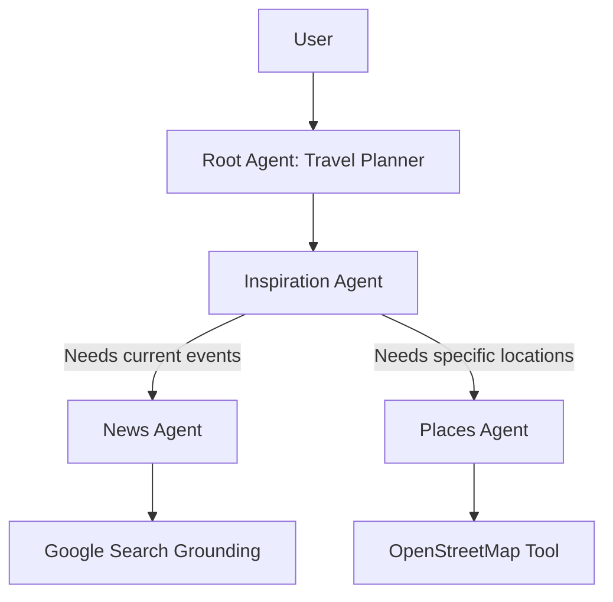

# Travel Planner (Multi‑Agent) – Powered by Google ADK

<div align="center">
	<p><em>An advanced, experimental travel concierge demonstrating the power of the <strong>Google Agent Development Kit (ADK)</strong>.</em></p>
    <p><em>Orchestrates specialized agents for inspiration, live news research, and geolocation—all grounded in real-world data.</em></p>
</div>

---

## 🚀 Why ADK? (Benefits & Key Factors)

This project serves as a reference implementation for the **Google Agent Development Kit (ADK)**, showcasing why ADK is a game-changer for building complex, reliable AI systems.

### Key Success Factors of ADK
*   **Agent-as-a-Tool Pattern**: ADK allows agents to be wrapped as tools for other agents. This **recursive composability** enables hierarchal architectures where a "Manager" agent can reliably delegate complex sub-tasks to "Specialist" agents without managing the low-level logic.
*   **Modularity & Scalability**: Each agent is a self-contained unit with its own Model, Tools, and Instructions. This makes it easy to swap usage (e.g., using a cheaper model for the "Places" agent and a reasoning-heavy model for the "Planner" agent).
*   **Structured Orchestration**: Unlike simple prompt chaining, ADK provides a robust framework for defining **typed inputs and outputs**, ensuring that agents communicate effectively and errors are handled gracefully.

---

## 🤖 The "Vital Role" of Agents in this Architecture

In this ADK-based architecture, each agent plays a specific, vital role. The system is designed not as a single monolith, but as a team of experts working together.

| Agent Name | Role & Responsibility | ADK Implementation Highlights |
| :--- | :--- | :--- |
| **`travel_planner_main`**<br>*(Root Agent)* | **The Orchestrator**<br>The primary interface for the user. It understands high-level intent (e.g., "Plan a 3-day trip to Paris") and delegates the "thinking" to the Inspiration Agent. | Acts as the entry point. Defined in `agent.py`. Demonstrates how to use other Agents (`travel_inspiration_agent`) as pure tools. |
| **`travel_inspiration_agent`**<br>*(Sub-Orchestrator)* | **The Domain Expert**<br>Responsible for the creative strategy. It doesn't just guess; it actively consults its own tools (News and Places agents) to build a grounded itinerary. | Encapsulates the logic of "how to plan". It decides *when* to check for events and *when* to find hotels. Defined in `supporting_agents.py`. |
| **`news_agent`**<br>*(Researcher)* | **The Grounding Source**<br>Fetches real-time info about events, safety, or weather. It ensures the travel plan is relevant *today*, not just based on training data. | Wraps the **Google Search Grounding** tool. Demonstrates how to effectively prompt for bullet-point, actionable intelligence. |
| **`places_agent`**<br>*(Utility Specialist)* | **The Local Guide**<br>Finds specific, physical locations (hotels, museums, cafes) with precise addresses and geolocation data. | Uses a custom `FunctionTool` (`location_search_tool`) that queries **OpenStreetMap (Overpass API)**, proving ADK can integrate with any external API/Tool freely. |

---

## 🛠 Project Overview

This is a lightweight yet powerful travel planning assistant. It combines the structured reasoning of LLMs with real-world tools to:
*   Suggest destinations & trip ideas.
*   Surface relevant travel news/events (Web Grounded).
*   Find nearby places (hotels, cafes, landmarks) using OpenStreetMap.
*   Contextualize location information.

**Environment**: Managed by **[uv](https://github.com/astral-sh/uv)** for ultra-fast Python dependency management.

## 🏗 Architecture Diagram



## ⚙️ Setup & Installation

### Prerequisites
*   **Python 3.11+**
*   **Google API Key** (for Gemini models/tools)
*   **uv** (recommended for dependency management)

### 1. Install uv
```bash
# macOS / Linux
curl -LsSf https://astral.sh/uv/install.sh | sh
```

### 2. Clone & Sync
```bash
git clone <repo-url>
cd Travel-planner-with-ADK
uv venv .venv
source .venv/bin/activate
uv sync
```

### 3. Configure Environment
Create a `.env` file in the root directory:
```bash
GOOGLE_API_KEY=your_actual_api_key_here
```

## 🚀 Running the Planner

### Quick Start
Run the main script to see the agents in action:
```bash
uv run python main.py
```

### Interactive Example (Python REPL)
You can import the agents directly to test different parts of the hierarchy:

```python
from travel_planner.agent import root_agent

# The full workflow
response = root_agent.run("Plan a romantic weekend in Kyoto for next month.")
print(response)
```


## 🕵️ Visualizing & Debugging with ADK Web UI

ADK comes with a powerful developer UI for monitoring and interacting with your agents.

### Start the Web UI
```bash
uv run adk web
```

### UI Benefits
*   **Real-Time Tracing**: Watch the agent's "thought process" as it executes. See exactly which tools it calls and why.
*   **Interactive Debugging**: Chat with your agent in a polished interface that exposes internal state, allowing you to catch logic errors instantly.
*   **Session Management**: Review past conversations and inspect the full history of agent actions.
*   **Visual Feedback**: A clean, modern dashboard to validate your multi-agent orchestration without reading raw logs.

## 📂 File Structure

*   **`travel_planner/agent.py`**: Defines the `root_agent`.
*   **`travel_planner/supporting_agents.py`**: Defines `travel_inspiration_agent`, `news_agent`, and `places_agent`.
*   **`travel_planner/tools.py`**: Contains tool definitions (`google_search_grounding`, `location_search_tool`).
*   **`main.py`**: Entry point for testing.

---

## ⚠️ Disclaimer
This is an experimental prototype using Generative AI. Responses should be verified for accuracy, especially regarding visas, safety, and bookings.

---
<p align="center">Made with ❤️ using <strong>Google ADK</strong></p>
